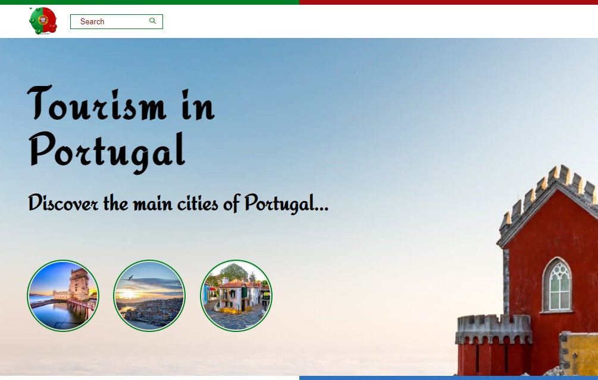

## Tourism In portugal !  ✈️ 🌄 🏝️
 

##  Uma landing page simples sobre turismo em Portugal, mostrando os principais cidades e pontos turisticos, com HTML5 Semântico e CSS3 conceitos de flexbox, Grid Layoute e responsive. 💻 📚
 

## Tecnologias que utilizei para o projeto ;  

 
    
    

 

## Projeto 🥰

### [Tourism Portugal](https://alisson-aguiars2k.github.io/tourism_in_portugal/) 🔗
